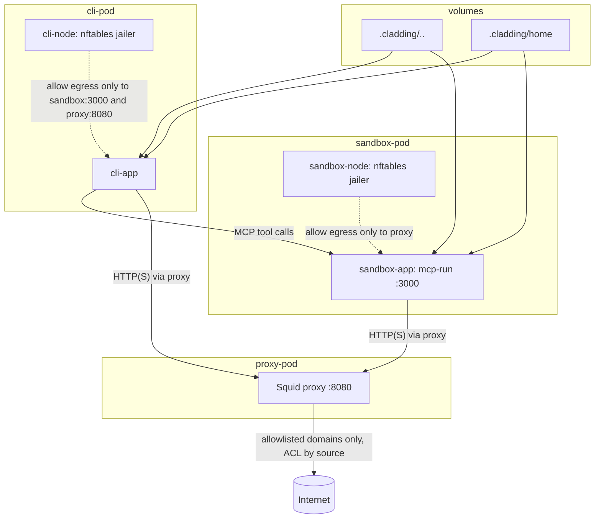

Run an agent in a constrained container environment where network access is intentionally narrow:

- The agent runs in `cli-pod`.
- Direct egress from the agent container is blocked except to:
  - `sandbox-pod` (`mcp-run` on port `3000`)
  - `proxy-pod` (Squid on port `8080`)
- `mcp-run` only executes commands allowed by Rego policy modules in `.cladding/config/sandbox_commands/` (templates under [`config-template/sandbox_commands/`](config-template/sandbox_commands/)).
- Outbound HTTP(S) from both CLI and sandbox is forced through Squid, which only permits domains from:
  - `.cladding/config/cli_domains.lst` (template: [`config-template/cli_domains.lst`](config-template/cli_domains.lst))
  - `.cladding/config/sandbox_domains.lst` (template: [`config-template/sandbox_domains.lst`](config-template/sandbox_domains.lst))

In short: the agent cannot freely access the network; it can delegate commands to `mcp-run` via MCP or the [`run-remote`](crates/mcp-run/src/bin/run-remote.rs) binary, where any external network path is gated by command policy plus domain allowlists.

For `mcp-run` server/tool API, policy authoring, and endpoint examples, see [`crates/mcp-run/README.md`](crates/mcp-run/README.md).

## Getting Started

* Install [Podman](https://podman.io/)
* Install the `cladding` binary:

  ```bash
  podman run --rm -it \
    -v $HOME/.local/bin:/usr/local/cargo/bin \
    rust:latest \
    cargo install --git https://github.com/dstoc/cladding --bin cladding
  ```

  Alternative (install Rust locally first):

  ```bash
  # install Rust
  curl --proto '=https' --tlsv1.2 -sSf https://sh.rustup.rs | sh
  # or on macOS with Homebrew
  brew install rust

  # from this repo
  cargo install --path . --bin cladding

  # or install directly from git
  cargo install --git https://github.com/dstoc/cladding --bin cladding
  ```

* Initialize local config:

  Config and mounts are stored in a `.cladding` directory.

  ```bash
  cladding init
  # or override generated name
  cladding init myproject
  ```

  `init`:
  - copies template files into `.cladding/config/`
  - generates `.cladding/config/cladding.json`
    - `name`: derived from current directory name or passed to `cladding init <name>` (alphanumeric)
  - default images: `localhost/cladding-default:latest` for both CLI and sandbox
    - subnet: auto-selected from an unused `10.90.X.0/24`
  - creates the Podman network `<name>_cladding_net`

* Edit files under `.cladding/config/`:

  - `.cladding/config/cladding.json` (generated by `cladding init`)
  - `.cladding/config/sandbox_commands/` (template dir: [`config-template/sandbox_commands/`](config-template/sandbox_commands/))
  - `.cladding/config/cli_domains.lst` (template: [`config-template/cli_domains.lst`](config-template/cli_domains.lst))
  - `.cladding/config/sandbox_domains.lst` (template: [`config-template/sandbox_domains.lst`](config-template/sandbox_domains.lst))

* Link or create:

  * storage for the home directory at `.cladding/home` - `/home/user`
  * project tools at `.cladding/tools` - `/opt/tools` (`/opt/tools/bin` is on `PATH`)

  ```bash
  ln -s /somewhere/home ./.cladding/home
  ln -s /somewhere/mytools ./.cladding/tools
  ```


* Build images and refresh host-mounted binaries (`mcp-run`, `run-with-network`) in `.cladding/tools/bin`:

  ```bash
  cladding build
  ```

* Start the environment:

  ```bash
  cladding up
  ```

* Run commands in the CLI container (workdir follows your host `cwd` relative to the directory containing `.cladding`):

  ```bash
  cladding run codex --yolo
  cladding run --env GEMINI_API_KEY gemini
  ```

### Configuring mounts

`cladding.json` supports a `mounts` list. Each entry has:

* `mount` (required, absolute path in the container)
* `hostPath` (optional, host bind mount; relative paths are resolved from `.cladding/`)
* `volume` (optional, named volume; mutually exclusive with `hostPath`)
* `readOnly` (optional, default `false`; ignored for `volume` mounts and forced `true` for emptyDir)

If neither `hostPath` nor `volume` is set, an `emptyDir` is used and mounted read-only.
Mounts apply only to `cli-app` and `sandbox-app`; other pod mounts are fixed.

Example:

```json
{
  "mounts": [
    { "mount": "/home/user/workspace/.cache/npm", "volume": "npm-cache" },
    { "mount": "/opt/data", "hostPath": "../data", "readOnly": true },
    { "mount": "/tmp/isolated" }
  ]
}
```

Default mounts (as if expressed via `mounts`):

```json
{
  "mounts": [
    { "mount": "/opt/config", "hostPath": "config", "readOnly": true },
    { "mount": "/opt/tools", "hostPath": "tools", "readOnly": true },
    { "mount": "/home/user", "hostPath": "home" },
    { "mount": "/home/user/workspace", "hostPath": ".." },
    { "mount": "/home/user/workspace/.cladding" }
  ]
}
```

Default mounts may be overidden by adding an entry with the same `mount` value.

## Architecture + Network Controls



## Useful Commands

```bash
cladding init [name]  # initialize .cladding, config and create network
cladding check        # verify required paths/images
cladding run [--env KEY[=VALUE] ...] [cmd] # run a command in the cli-app container
cladding reload-proxy # reconfigure squid after domain-list edits
cladding down         # stop associated pods
cladding destroy      # force-remove running containers
podman logs -f <name>-proxy-pod-proxy           # view proxy logs
podman logs -f <name>-sandbox-pod-sandbox-app   # sandbox (mcp-run) logs
```
