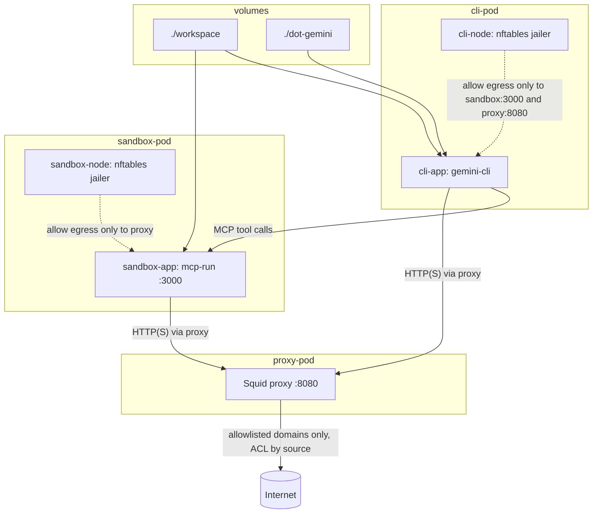

Run an agent in a constrained container environment where network access is intentionally narrow:

- The agent (`gemini-cli`) runs in `cli-pod`.
- Direct egress from the agent container is blocked except to:
  - `sandbox-pod` (`mcp-run` on port `3000`)
  - `proxy-pod` (Squid on port `8080`)
- `mcp-run` only executes commands allowed by [`config/mcp-run-policy.json`](config/mcp-run-policy.json) (command + arg checks, optional env allowlist).
- Outbound HTTP(S) from both CLI and sandbox is forced through Squid, which only permits domains from:
  - [`config/cli_domains.lst`](config/cli_domains.lst)
  - [`config/sandbox_domains.lst`](config/sandbox_domains.lst)

In short: the agent cannot freely access the network; it can call MCP tools, and any external network path is gated by command policy plus domain allowlists.

## Getting Started

1. Initialize local config from template:

```bash
./cladding init
```

2. Edit files under [`config/`](config/) (at minimum):
- [`config/mcp-run-policy.json`](config/mcp-run-policy.json)
- [`config/cli_domains.lst`](config/cli_domains.lst)
- [`config/sandbox_domains.lst`](config/sandbox_domains.lst)

3. Link persistent Gemini state to [`dot-gemini`](dot-gemini):

```bash
ln -s /somewhere/gemini-storage ./dot-gemini
```

4. Link the workspace you want mounted into the containers at [`workspace`](workspace):

```bash
ln -s /somewhere/mystuff ./workspace
```

5. Build images (first run, or after image-related changes):

```bash
./cladding build
```

6. Start the environment:

```bash
./cladding up
```

7. Launch Gemini in the CLI container:

```bash
./cladding gemini
```

## Architecture + Network Controls



## Useful Commands

```bash
./cladding check        # verify required paths/images
./cladding reload-proxy # reconfigure squid after domain-list edits
./cladding down         # stop pods from the pod manifest
./cladding destroy      # force-remove running containers
```
