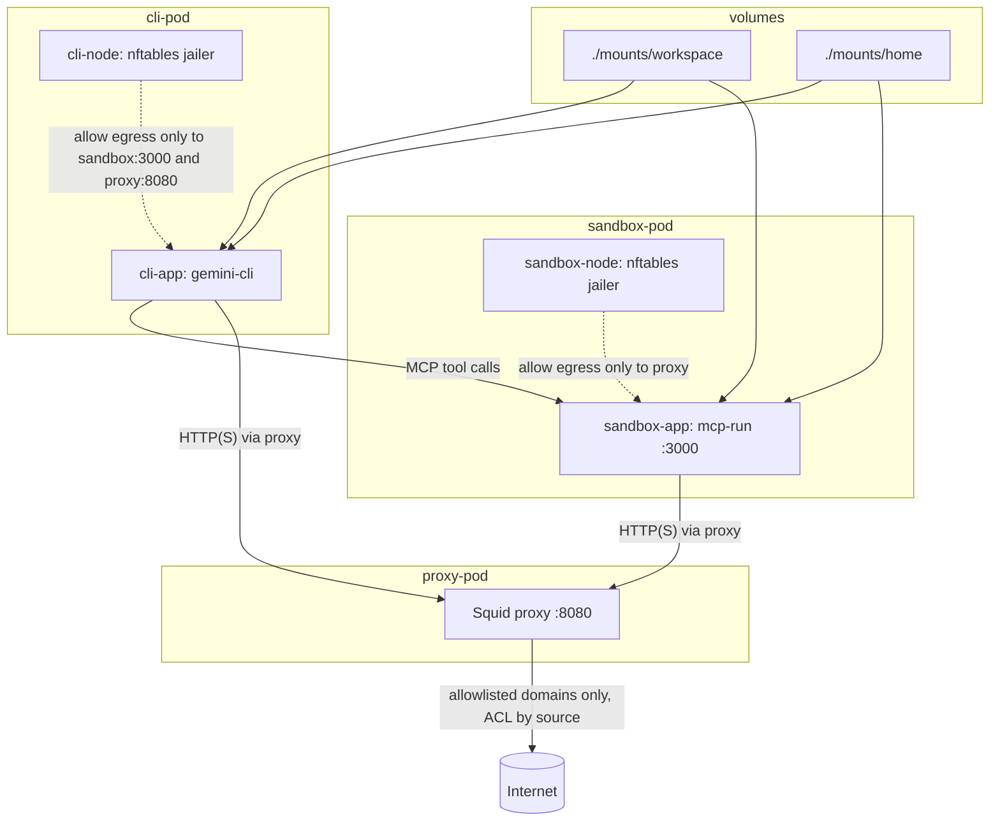

Run an agent in a constrained container environment where network access is intentionally narrow:

- The agent (`gemini-cli`) runs in `cli-pod`.
- Direct egress from the agent container is blocked except to:
  - `sandbox-pod` (`mcp-run` on port `3000`)
  - `proxy-pod` (Squid on port `8080`)
- `mcp-run` only executes commands allowed by [`config/mcp-run-policy.json`](config-template/mcp-run-policy.json) (command + arg checks, optional env allowlist).
- Outbound HTTP(S) from both CLI and sandbox is forced through Squid, which only permits domains from:
  - [`config/cli_domains.lst`](config-template/cli_domains.lst)
  - [`config/sandbox_domains.lst`](config-template/sandbox_domains.lst)

In short: the agent cannot freely access the network; it can delegate commands to `mcp-run` via MCP or the [`run-remote` binary](mcp-run/src/bin/run-remote.rs), where any external network path is gated by command policy plus domain allowlists.

## Getting Started

* Initialize local config from template:

  ```bash
  ./cladding init
  ```

* Edit files under [`config/`](config-template/):

  - [`config/mcp-run-policy.json`](config-template/mcp-run-policy.json)
  - [`config/cli_domains.lst`](config-template/cli_domains.lst)
  - [`config/sandbox_domains.lst`](config-template/sandbox_domains.lst)

* Link or create:

  * storage for the home directory at [`mounts/home`](mounts/home) - `/home/user`
  * a workspace folder at [`mounts/workspace`](mounts/workspace) - `/home/user/workspace`
  * read-only binaries, etc. at [`mounts/bin`](mounts/bin) - `/usr/local/bin`

  ```bash
  ln -s /somewhere/home ./mounts/home
  ln -s /somewhere/mystuff ./mounts/workspace
  ln -s /somewhere/mytools ./mounts/bin
  ```


* Build images (first run, or after image-related changes):

  ```bash
  ./cladding build
  ```

* Start the environment:

  ```bash
  ./cladding up
  ```

* Launch Gemini in the CLI container:

  ```bash
  ./cladding gemini
  ```

## Mounts

| Host path | Container path | Used by | Mode | Purpose |
| --- | --- | --- | --- | --- |
| `./config` | `/opt/config` | `proxy`, `sandbox-app`, `cli-app` | Read-only | Shared runtime config (policy, domain allowlists, Squid inputs). |
| `./mounts/home` | `/home/user` | `sandbox-app`, `cli-app` | Read-write | User home directory shared by CLI and sandbox app containers. |
| `./mounts/workspace` | `/home/user/workspace` | `sandbox-app`, `cli-app` | Read-write | Working tree shared between CLI and sandbox app containers. |
| `./mounts/bin` | `/usr/local/bin` | `sandbox-app`, `cli-app` | Read-only | Optional host-provided helper binaries available in both app containers. |
| `./scripts` | `/opt/scripts` | `proxy`, `sandbox-node`, `cli-node` | Read-only | Startup and jail scripts run by the helper containers. |

## Architecture + Network Controls



## Useful Commands

```bash
./cladding check        # verify required paths/images
./cladding reload-proxy # reconfigure squid after domain-list edits
./cladding down         # stop pods from the pod manifest
./cladding destroy      # force-remove running containers
podman exec -t -i cli-pod-cli-app /bin/zsh      # get a shell in cli-app
podman logs -f proxy-pod-proxy                  # view proxy logs
podman logs -f sandbox-pod-sandbox-app          # sandbox (mcp-run) logs
```
