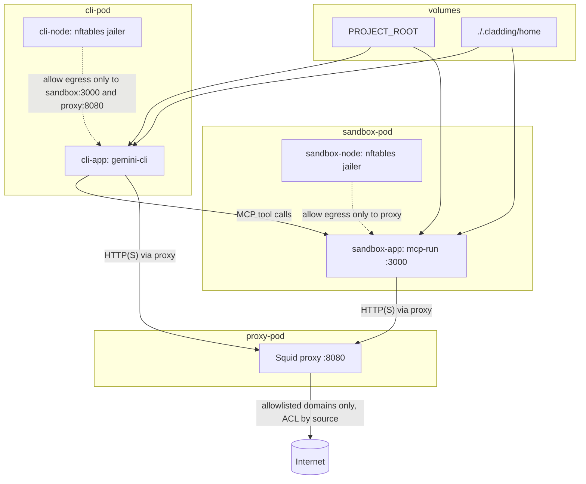

Run an agent in a constrained container environment where network access is intentionally narrow:

- The agent (`gemini-cli`) runs in `cli-pod`.
- Direct egress from the agent container is blocked except to:
  - `sandbox-pod` (`mcp-run` on port `3000`)
  - `proxy-pod` (Squid on port `8080`)
- `mcp-run` only executes commands allowed by `.cladding/config/mcp-run-policy.json` (template: [`config-template/mcp-run-policy.json`](config-template/mcp-run-policy.json)) (command + arg checks, optional env allowlist).
- Outbound HTTP(S) from both CLI and sandbox is forced through Squid, which only permits domains from:
  - `.cladding/config/cli_domains.lst` (template: [`config-template/cli_domains.lst`](config-template/cli_domains.lst))
  - `.cladding/config/sandbox_domains.lst` (template: [`config-template/sandbox_domains.lst`](config-template/sandbox_domains.lst))

In short: the agent cannot freely access the network; it can delegate commands to `mcp-run` via MCP or the [`run-remote` binary](mcp-run/src/bin/run-remote.rs), where any external network path is gated by command policy plus domain allowlists.

## Getting Started

* Project root discovery:

  - `cladding` searches from the current working directory upward for a `.cladding/` directory.
  - The first match becomes `PROJECT_ROOT`.
  - `help` works without a `.cladding/` directory.
  - `init` works without a `.cladding/` directory and creates `./.cladding` in the current directory.
  - All other commands require `.cladding/` to be found.

* Initialize local config from template:

  ```bash
  ./cladding init
  ```

* Edit files under `.cladding/config/`:

  - `.cladding/config/mcp-run-policy.json` (template: [`config-template/mcp-run-policy.json`](config-template/mcp-run-policy.json))
  - `.cladding/config/cli_domains.lst` (template: [`config-template/cli_domains.lst`](config-template/cli_domains.lst))
  - `.cladding/config/sandbox_domains.lst` (template: [`config-template/sandbox_domains.lst`](config-template/sandbox_domains.lst))

* Link or create:

  * storage for the home directory at `.cladding/home` - `/home/user`
  * project tools at `.cladding/tools` - `/opt/tools` (`/opt/tools/bin` is on `PATH`)

  ```bash
  ln -s /somewhere/home ./.cladding/home
  ln -s /somewhere/mytools ./.cladding/tools
  ```


* Build images and refresh host-mounted binaries (`mcp-run`, `run-with-network`) in `.cladding/tools/bin`:

  ```bash
  ./cladding build
  ```

* Start the environment:

  ```bash
  ./cladding up
  ```

* Launch Gemini in the CLI container:

  ```bash
  ./cladding gemini
  ```

## Mounts

| Host path | Container path | Used by | Mode | Purpose |
| --- | --- | --- | --- | --- |
| `./.cladding/home` | `/home/user` | `sandbox-app`, `cli-app` | Read-write | User home directory shared by CLI and sandbox app containers. |
| `./.cladding/..` | `/home/user/workspace` | `sandbox-app`, `cli-app` | Read-write | Workspace root mounted directly from the discovered project root (`.cladding`). |
| `-` | `/home/user/workspace/.cladding` | `sandbox-app`, `cli-app` | Read-only | Masks `.cladding` inside the workspace mount so it is not exposed. |
| `./.cladding/config` | `/opt/config` | `proxy`, `sandbox-app`, `cli-app` | Read-only | Shared runtime config (policy, domain allowlists, Squid inputs). |
| `./.cladding/tools` | `/opt/tools` | `sandbox-app`, `cli-app` | Read-only | Host-provided tools mounted into both app containers (`/opt/tools/bin` is on `PATH`). |
| `<cladding install>/scripts` | `/opt/scripts` | `proxy`, `sandbox-node`, `cli-node` | Read-only | Startup and jail scripts from the `cladding` installation directory. |

## Architecture + Network Controls



## Useful Commands

```bash
./cladding check        # verify required paths/images
./cladding reload-proxy # reconfigure squid after domain-list edits
./cladding down         # stop pods from the pod manifest
./cladding destroy      # force-remove running containers
podman exec -t -i cli-pod-cli-app /bin/zsh      # get a shell in cli-app
podman logs -f proxy-pod-proxy                  # view proxy logs
podman logs -f sandbox-pod-sandbox-app          # sandbox (mcp-run) logs
```
