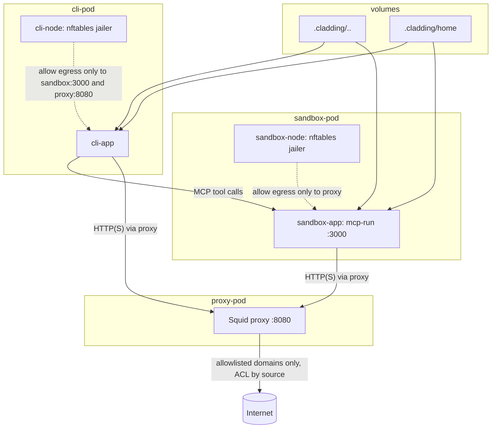

Cladding lets you run an agent in a constrained container environment where network access is intentionally narrow:

- The agent runs in `cli-pod`.
- Direct egress from the agent container is [blocked](scripts/jail_cli.sh) except to:
  - `sandbox-pod` ([`mcp-run`](crates/mcp-run/README.md) on port `3000`)
  - `proxy-pod` (Squid on port `8080`)
  - `host.containers.internal` on ports specified in [`config-template/cli_host_ports.lst`](config-template/cli_host_ports.lst).
- `sandbox-pod` serves [`mcp-run`](crates/mcp-run/README.md) which executes commands, but only those allowed by the Rego policy modules in `.cladding/config/sandbox_commands/` (templates under [`config-template/sandbox_commands/`](config-template/sandbox_commands/)).
- HTTP(S) from both CLI and sandbox is allowed through Squid on `proxy-pod`, which only permits domains from:
  - `.cladding/config/cli_domains.lst` (template: [`config-template/cli_domains.lst`](config-template/cli_domains.lst))
  - `.cladding/config/sandbox_domains.lst` (template: [`config-template/sandbox_domains.lst`](config-template/sandbox_domains.lst))

In short: the agent cannot freely access the network; it can delegate commands to [`mcp-run`](crates/mcp-run/README.md) via MCP or the [`run-remote`](crates/mcp-run/src/bin/run-remote.rs) binary, where any external network path is gated by command policy plus domain allowlists.

## Getting Started

* Install [Podman](https://podman.io/)
* Install the `cladding` binary:

  ```bash
  podman run --rm -it \
    -v $HOME/.local/bin:/target/bin \
    rust:latest \
    cargo install --git https://github.com/dstoc/cladding cladding --root /target --force
  ```

  Alternative (install Rust locally first):

  ```bash
  # install Rust
  curl --proto '=https' --tlsv1.2 -sSf https://sh.rustup.rs | sh
  # or on macOS with Homebrew
  brew install rust

  # from this repo
  cargo install --path . --bin cladding

  # or install directly from git
  cargo install --git https://github.com/dstoc/cladding cladding
  ```

* Initialize local config:

  Config and mounts are stored in a `.cladding` directory.

  ```bash
  cladding init
  # or override generated name
  cladding init myproject
  ```

* Edit files under `.cladding/config/`:

  - `.cladding/config/cladding.json` (generated by `cladding init`)
  - `.cladding/config/sandbox_commands/` (template dir: [`config-template/sandbox_commands/`](config-template/sandbox_commands/))
  - `.cladding/config/cli_domains.lst` (template: [`config-template/cli_domains.lst`](config-template/cli_domains.lst))
  - `.cladding/config/sandbox_domains.lst` (template: [`config-template/sandbox_domains.lst`](config-template/sandbox_domains.lst))

* Build images and refresh host-mounted binaries (`mcp-run`, `run-with-network`) in `.cladding/tools/bin`:

  ```bash
  cladding build
  ```

* Start the environment:

  ```bash
  cladding up
  ```

* Run commands in the CLI container (workdir follows your host `cwd` relative to the directory containing `.cladding`):

  ```bash
  cladding run codex --yolo
  cladding run --env GEMINI_API_KEY gemini
  ```

### Configuring mounts

`cladding.json` supports a `mounts` list. Each entry has:

* `mount` (required, absolute path in the container)
* `hostPath` (optional, host bind mount; relative paths are resolved from `.cladding/`)
* `volume` (optional, named volume; mutually exclusive with `hostPath`)
* `readOnly` (optional, default `false`; ignored for `volume` mounts and forced `true` for empty mask mounts)
* `sandboxOnly` (optional, default `false`; if true, mount applies only to `sandbox-app`)

If neither `hostPath` nor `volume` is set, an empty ConfigMap is used and mounted read-only - this is intended for masking or hiding underlying files, as used to hide `.cladding` by default.
Mounts apply only to `cli-app` and `sandbox-app` (or only `sandbox-app` when `sandboxOnly` is true); other pod mounts are fixed.

Example:

```json
{
  "mounts": [
    { "mount": "/home/user/workspace/.cache/npm", "volume": "npm-cache" },
    { "mount": "/opt/data", "hostPath": "../data", "readOnly": true },
    { "mount": "/tmp/isolated" },
    { "mount": "/opt/sandbox-only", "hostPath": "../sandbox-data", "sandboxOnly": true }
  ]
}
```

Default mounts (as if expressed via `mounts`):

```json
{
  "mounts": [
    { "mount": "/opt/config", "hostPath": "config", "readOnly": true },
    { "mount": "/opt/tools", "hostPath": "tools", "readOnly": true },
    { "mount": "/home/user", "hostPath": "home" },
    { "mount": "/home/user/workspace", "hostPath": ".." },
    { "mount": "/home/user/workspace/.cladding" }
  ]
}
```

Default mounts may be overidden by adding an entry with the same `mount` value.

## Architecture + Network Controls


```mermaid
flowchart TB
  subgraph C[cli-pod]
    CJ[cli-node: nftables jailer]
    CA[cli-app]
  end

  subgraph H[volumes]
    WS[.cladding/..]
    HOME[.cladding/home]
  end


  subgraph S[sandbox-pod]
    SJ[sandbox-node: nftables jailer]
    SA[sandbox-app: mcp-run :3000]
  end

  subgraph P[proxy-pod]
    PX[Squid proxy :8080]
  end

  WS --> CA
  WS --> SA
  HOME --> CA
  HOME --> SA

  CA -- MCP tool calls --> SA
  CA -- HTTP(S) via proxy --> PX
  SA -- HTTP(S) via proxy --> PX
  PX -- allowlisted domains only, ACL by source --> NET[(Internet)]

  CJ -. allow egress only to sandbox:3000 and proxy:8080 .-> CA
  SJ -. allow egress only to proxy .-> SA
```

## Useful Commands

```bash
cladding init [name] [--update-scripts]  # initialize or update .cladding and config
cladding check        # verify required paths/images
cladding ps           # list running cladding projects
cladding run [--env KEY[=VALUE] ...] [cmd] # run a command in the cli-app container
cladding reload-proxy # reconfigure squid after domain-list edits
cladding down         # stop associated pods
cladding destroy      # force-remove running containers
cladding up           # starts the containers
podman logs -f <name>-proxy-pod-proxy           # view proxy logs
podman logs -f <name>-sandbox-pod-sandbox-app   # sandbox (mcp-run) logs
```
