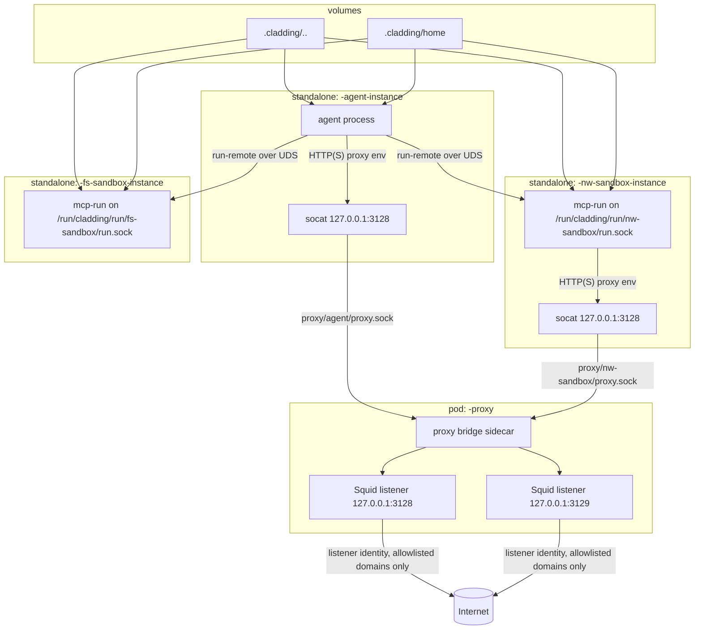

Cladding lets you run an agent in a constrained container environment where network access is intentionally narrow:

- The agent runs as a standalone `--network none` container named `<name>-agent-instance`.
- Optional delegated sandboxes run as standalone `--network none` containers named `<name>-nw-sandbox-instance` and `<name>-fs-sandbox-instance`.
- HTTP(S) egress is mediated by the `<name>-proxy` pod. Execution containers reach it through scoped Unix-domain socket mounts and local `socat` loopback bridges, and Squid uses separate listeners to distinguish agent traffic from network-sandbox traffic.
- The agent can reach `host.containers.internal` only on ports listed in [`config-template/agent/host_ports.lst`](config-template/agent/host_ports.lst).
- `<name>-nw-sandbox-instance` and `<name>-fs-sandbox-instance` each serve [`mcp-run`](crates/mcp-run/README.md) on a mounted Unix socket and execute commands only when allowed by their Rego policy modules under `.cladding/config/`.
- Proxy allow-lists come from:
  - `.cladding/config/agent/domains.lst` (template: [`config-template/agent/domains.lst`](config-template/agent/domains.lst))
  - `.cladding/config/nw_sandbox/domains.lst` when network sandboxing is enabled (template: [`config-template/nw_sandbox/domains.lst`](config-template/nw_sandbox/domains.lst))

In short: the agent cannot freely access the network; users can run sandbox commands from the host with [`cladding run-with-scissors`](#useful-commands), while commands running inside the agent can delegate to sandbox containers with `run-in-nw-sandbox` or `run-in-fs-sandbox`.

## Getting Started

* Install [Podman](https://podman.io/)
* Install the `cladding` binary:

  ```bash
  podman run --rm -it \
    -v $HOME/.local/bin:/target/bin \
    rust:latest \
    cargo install --git https://github.com/dstoc/cladding cladding --root /target --force
  ```

  Alternative (install Rust locally first):

  ```bash
  # install Rust
  curl --proto '=https' --tlsv1.2 -sSf https://sh.rustup.rs | sh
  # or on macOS with Homebrew
  brew install rust

  # from this repo
  cargo install --path . --bin cladding

  # or install directly from git
  cargo install --git https://github.com/dstoc/cladding cladding
  ```

* Initialize local config:

  Config and mounts are stored in a `.cladding` directory.

  ```bash
  cladding init
  # or override generated name
  cladding init myproject
  ```

* Edit files under `.cladding/config/`:

  - `.cladding/cladding.json` (generated by `cladding init`)
  - `.cladding/config/agent/domains.lst` (template: [`config-template/agent/domains.lst`](config-template/agent/domains.lst))
  - `.cladding/config/agent/host_ports.lst` (template: [`config-template/agent/host_ports.lst`](config-template/agent/host_ports.lst))
  - `.cladding/config/nw_sandbox/domains.lst` and Rego policies when `nw_sandbox` is enabled (template dir: [`config-template/nw_sandbox/`](config-template/nw_sandbox/))
  - `.cladding/config/fs_sandbox/` Rego policies when `fs_sandbox` is enabled (template dir: [`config-template/fs_sandbox/`](config-template/fs_sandbox/))

  Generated proxy scripts and Squid runtime config are refreshed under `.cladding/runtime/scripts/` by `cladding up`; they are not user-editable config.

* Build images and refresh host-mounted binaries (`mcp-run`, `run-remote`, and sandbox helper wrappers) in `.cladding/tools/bin`:

  ```bash
  cladding build
  ```

* Start the environment:

  ```bash
  cladding up
  ```

* Run commands in the agent container (workdir follows your host `cwd` relative to the directory containing `.cladding`; if it cannot be mapped, the command starts in `/home/user`):

  ```bash
  cladding run codex --yolo
  cladding run --env GEMINI_API_KEY gemini
  ```

* Temporarily publish a TCP port from the agent container to the host while the project is running:

  ```bash
  cladding expose 3000
  cladding expose 3000 9000
  cladding expose 3000 --bind-address 192.168.1.20
  cladding expose 3000 9000 --bind-address ::1
  ```

  `cladding expose` runs in the foreground and defaults to listening on
  `127.0.0.1`. Use `--bind-address` to select a host IP address; `0.0.0.0`
  or `::` listens on all IPv4 or IPv6 interfaces respectively. Stop it with
  Ctrl-C.

* Temporarily make one host-reachable TCP endpoint available on agent localhost while the project is running:

  ```bash
  cladding inject 11434
  cladding inject 5432 15432
  cladding inject db.internal:5432 15432
  ```

  `cladding inject <host-endpoint> [containerport]` runs in the foreground and stops with Ctrl-C. A bare port such as `11434` maps agent `127.0.0.1:11434` to host `127.0.0.1:11434`. A second port changes only the agent-side listener, so `cladding inject 5432 15432` maps agent `127.0.0.1:15432` to host `127.0.0.1:5432`. An explicit `host:port` is resolved from the host and should be treated as a deliberate temporary exception for that one endpoint, not general host networking.

### Configuring container images

Each component can use an existing image or build one from a Containerfile. The component `image` value is the build output tag when `build` is also set. If `image` is omitted, `cladding build` generates a local tag such as `localhost/cladding-myproject-agent:latest`.

```json
{
  "name": "myproject",
  "agent": {
    "build": {
      "containerfile": "containers/agent.Containerfile",
      "context": ".",
      "args": { "FEATURE": "enabled" }
    }
  },
  "nw_sandbox": {
    "enabled": true,
    "image": "localhost/my-sandbox:latest",
    "build": {
      "containerfile": "containers/sandbox.Containerfile",
      "context": ".."
    }
  },
  "fs_sandbox": {
    "image": "localhost/my-fs-sandbox:latest",
    "build": {
      "containerfile": "containers/fs-sandbox.Containerfile",
      "context": ".."
    }
  },
  "proxy": {
    "image": "localhost/my-proxy:latest",
    "build": {
      "containerfile": "containers/proxy.Containerfile",
      "context": "."
    }
  }
}
```

`containerfile` and `context` paths are relative to `.cladding/cladding.json`. `context` defaults to the `.cladding` directory when omitted. Build `args` are string values passed to Podman as ordinary Containerfile build arguments.

`cladding build` preserves the embedded default image build and its host `UID` and `GID` arguments. It builds each shared image once and reports an error if components specify different builds for the same image tag.

The default proxy image is used when `proxy` is omitted. Set `proxy.image` to use a prebuilt proxy image, or configure `proxy.build` to build a proxy image locally.

### Configuring mounts

`cladding.json` supports a `mounts` list. Each entry has:

* `mount` (required, absolute path in the container)
* `hostPath` (optional, host bind mount; relative paths are resolved from `.cladding/`)
* `volume` (optional, named volume; mutually exclusive with `hostPath`)
* `readOnly` (optional, default `false`; ignored for `volume` mounts and forced `true` for empty mask mounts)
* `targets` (optional; explicit list of `agent`, `nw-sandbox`, `fs-sandbox`)
* `ignore` (optional, default `false`; when true, removes an existing default mount at the same `mount` path instead of replacing it)

If neither `hostPath` nor `volume` is set, a managed empty runtime volume is mounted read-only - this is intended for masking or hiding underlying files.
Mounts apply to the components named in `targets`. When `targets` is omitted, the mount applies to the agent and to `nw-sandbox` when it is enabled. `fs-sandbox` only receives custom mounts that explicitly target `fs-sandbox`.

Example:

```json
{
  "agent": {
    "image": "cladding-agent:local"
  },
  "nw_sandbox": {
    "enabled": true,
    "image": "cladding-sandbox:local"
  },
  "mounts": [
    { "mount": "/home/user/workspace/.cache/npm", "volume": "npm-cache" },
    { "mount": "/opt/data", "hostPath": "../data", "readOnly": true },
    { "mount": "/tmp/isolated" },
    { "mount": "/opt/nw-sandbox-only", "hostPath": "../nw-sandbox-data", "targets": ["nw-sandbox"] },
    { "mount": "/opt/fs-sandbox-only", "hostPath": "../fs-sandbox-data", "targets": ["fs-sandbox"] }
  ]
}
```

Default mounts for the agent and `nw-sandbox` (as if expressed via `mounts`):

```json
{
  "mounts": [
    { "mount": "/opt/config", "hostPath": "config", "readOnly": true },
    { "mount": "/opt/tools", "hostPath": "tools", "readOnly": true },
    { "mount": "/home/user", "hostPath": "home" },
    { "mount": "/home/user/workspace", "hostPath": ".." },
    { "mount": "/home/user/workspace/.cladding" }
  ]
}
```

The `fs-sandbox` default mount set is narrower: `/opt/config` and `/opt/tools` are mounted read-only, plus an internal run socket under `/run/cladding/run/fs-sandbox`. It does not receive `/home/user`, `/home/user/workspace`, or the `.cladding` workspace mask unless custom mounts explicitly target `fs-sandbox`.

Default mounts may be overridden by adding an entry with the same `mount` value, or removed by adding an entry with the same `mount` and `"ignore": true`.

## Architecture + Network Controls

Current runtime shape:

- `<name>-proxy` is the only Podman pod. It contains `<name>-proxy-instance` and `<name>-proxy-bridge`.
- `<name>-agent-instance`, `<name>-nw-sandbox-instance`, and `<name>-fs-sandbox-instance` are standalone execution containers with `--network none`.
- Execution containers communicate through scoped Unix-domain socket mounts under `.cladding/runtime/sockets`.
- `use_runsc`, when enabled, applies only to the standalone execution containers.


```mermaid
flowchart TB
  subgraph C["standalone: <name>-agent-instance"]
    CA[agent process]
    CAP[socat 127.0.0.1:3128]
  end

  subgraph H[volumes]
    WS[.cladding/..]
    HOME[.cladding/home]
  end


  subgraph S["standalone: <name>-nw-sandbox-instance"]
    SAP[socat 127.0.0.1:3128]
    SA[mcp-run on /run/cladding/run/nw-sandbox/run.sock]
  end

  subgraph F["standalone: <name>-fs-sandbox-instance"]
    FA[mcp-run on /run/cladding/run/fs-sandbox/run.sock]
  end

  subgraph P["pod: <name>-proxy"]
    PB[proxy bridge sidecar]
    PX1[Squid listener 127.0.0.1:3128]
    PX2[Squid listener 127.0.0.1:3129]
  end

  WS --> CA
  WS --> SA
  WS --> FA
  HOME --> CA
  HOME --> SA
  HOME --> FA

  CA -- run-remote over UDS --> SA
  CA -- run-remote over UDS --> FA
  CA -- HTTP(S) proxy env --> CAP
  CAP -- proxy/agent/proxy.sock --> PB
  SAP -- proxy/nw-sandbox/proxy.sock --> PB
  PB --> PX1
  PB --> PX2
  SA -- HTTP(S) proxy env --> SAP
  PX1 -- listener identity, allowlisted domains only --> NET[(Internet)]
  PX2 -- listener identity, allowlisted domains only --> NET
```

The filesystem sandbox has no proxy socket mount and no proxy environment by default. It can run allowed commands through `mcp-run`, but it is not given HTTP(S) egress.

## Useful Commands

```bash
cladding init [name]  # initialize .cladding and config
cladding check        # verify required paths/images
cladding ps           # list running cladding projects
cladding run [--env KEY[=VALUE] ...] [cmd] # run a command in the agent container
cladding run-with-scissors [--target nw-sandbox|fs-sandbox] [--env KEY[=VALUE] ...] [cmd] # run a command in an enabled sandbox container
cladding expose <containerport> [hostport] [--bind-address <address>] # block while forwarding host address/port to agent containerport
cladding inject <host-endpoint> [containerport] # block while forwarding agent localhost containerport to a host-reachable endpoint
cladding reload-proxy # reconfigure squid after domain-list edits
cladding logs [agent|proxy|nw-sandbox|fs-sandbox] [podman logs args...] # view container logs
cladding down         # stop managed containers and the proxy pod
cladding destroy      # force-remove running containers
cladding up           # starts the containers
cladding logs proxy -f       # follow proxy logs
cladding logs nw-sandbox -f  # follow network sandbox (mcp-run) logs
cladding logs fs-sandbox -f  # follow filesystem sandbox (mcp-run) logs
```

Inside the agent container, use `run-in-nw-sandbox -- <cmd> [args...]` or `run-in-fs-sandbox -- <cmd> [args...]` to ask an enabled sandbox to run an allowlisted command. These wrappers call `run-remote` over the component-specific Unix socket injected into the agent environment.
