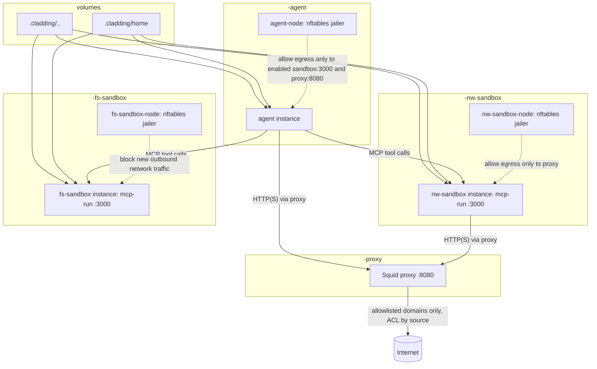

Cladding lets you run an agent in a constrained container environment where network access is intentionally narrow:

- The agent runs in `<name>-agent`.
- Optional delegated sandboxes run in `<name>-nw-sandbox` and `<name>-fs-sandbox`.
- Direct egress from the agent container is [blocked](scripts/jail_agent.sh) except to:
  - enabled sandbox containers on port `3000`
  - `<name>-proxy` (Squid on port `8080`)
  - `host.containers.internal` on ports specified in [`config-template/agent/host_ports.lst`](config-template/agent/host_ports.lst).
- `<name>-nw-sandbox` and `<name>-fs-sandbox` each serve [`mcp-run`](crates/mcp-run/README.md) and execute commands only when allowed by their Rego policy modules under `.cladding/config/`.
- HTTP(S) from the agent and the network sandbox is allowed through Squid on `<name>-proxy`, which only permits domains from:
  - `.cladding/config/agent/domains.lst` (template: [`config-template/agent/domains.lst`](config-template/agent/domains.lst))
  - `.cladding/config/nw_sandbox/domains.lst` (template: [`config-template/nw_sandbox/domains.lst`](config-template/nw_sandbox/domains.lst))

In short: the agent cannot freely access the network; users can run sandbox commands from the host with [`cladding run-with-scissors`](#useful-commands), while commands running inside the agent can delegate to sandbox containers with `run-in-nw-sandbox` or `run-in-fs-sandbox`.

## Getting Started

* Install [Podman](https://podman.io/)
* Install the `cladding` binary:

  ```bash
  podman run --rm -it \
    -v $HOME/.local/bin:/target/bin \
    rust:latest \
    cargo install --git https://github.com/dstoc/cladding cladding --root /target --force
  ```

  Alternative (install Rust locally first):

  ```bash
  # install Rust
  curl --proto '=https' --tlsv1.2 -sSf https://sh.rustup.rs | sh
  # or on macOS with Homebrew
  brew install rust

  # from this repo
  cargo install --path . --bin cladding

  # or install directly from git
  cargo install --git https://github.com/dstoc/cladding cladding
  ```

* Initialize local config:

  Config and mounts are stored in a `.cladding` directory.

  ```bash
  cladding init
  # or override generated name
  cladding init myproject
  ```

* Edit files under `.cladding/config/`:

  - `.cladding/cladding.json` (generated by `cladding init`)
  - `.cladding/config/agent/domains.lst` (template: [`config-template/agent/domains.lst`](config-template/agent/domains.lst))
  - `.cladding/config/agent/host_ports.lst` (template: [`config-template/agent/host_ports.lst`](config-template/agent/host_ports.lst))
  - `.cladding/config/nw_sandbox/domains.lst` and Rego policies when `nw_sandbox` is enabled (template dir: [`config-template/nw_sandbox/`](config-template/nw_sandbox/))
  - `.cladding/config/fs_sandbox/` Rego policies when `fs_sandbox` is enabled (template dir: [`config-template/fs_sandbox/`](config-template/fs_sandbox/))
  - `.cladding/config/proxy/squid.conf` (template: [`config-template/proxy/squid.conf`](config-template/proxy/squid.conf))

* Build images and refresh host-mounted binaries (`mcp-run`, `run-remote`, and sandbox helper wrappers) in `.cladding/tools/bin`:

  ```bash
  cladding build
  ```

* Start the environment:

  ```bash
  cladding up
  ```

* Run commands in the agent container (workdir follows your host `cwd` relative to the directory containing `.cladding`):

  ```bash
  cladding run codex --yolo
  cladding run --env GEMINI_API_KEY gemini
  ```

* Temporarily publish a TCP port from the agent container to the host while the project is running:

  ```bash
  cladding expose 3000
  cladding expose 3000 9000
  cladding expose list
  cladding expose stop 9000
  ```

  These mappings are runtime-only and are removed by `cladding down` and `cladding destroy`.

### Configuring mounts

`cladding.json` supports a `mounts` list. Each entry has:

* `mount` (required, absolute path in the container)
* `hostPath` (optional, host bind mount; relative paths are resolved from `.cladding/`)
* `volume` (optional, named volume; mutually exclusive with `hostPath`)
* `readOnly` (optional, default `false`; ignored for `volume` mounts and forced `true` for empty mask mounts)
* `targets` (optional; explicit list of `agent`, `nw-sandbox`, `fs-sandbox`)
* `ignore` (optional, default `false`; when true, removes an existing default mount at the same `mount` path instead of replacing it)

If neither `hostPath` nor `volume` is set, a managed empty runtime volume is mounted read-only - this is intended for masking or hiding underlying files.
Mounts apply to the components named in `targets`. When `targets` is omitted, the mount applies to all enabled execution containers.

Example:

```json
{
  "agent": {
    "image": "cladding-agent:local"
  },
  "nw_sandbox": {
    "enabled": true,
    "image": "cladding-sandbox:local"
  },
  "mounts": [
    { "mount": "/home/user/workspace/.cache/npm", "volume": "npm-cache" },
    { "mount": "/opt/data", "hostPath": "../data", "readOnly": true },
    { "mount": "/tmp/isolated" },
    { "mount": "/opt/nw-sandbox-only", "hostPath": "../nw-sandbox-data", "targets": ["nw-sandbox"] },
    { "mount": "/opt/fs-sandbox-only", "hostPath": "../fs-sandbox-data", "targets": ["fs-sandbox"] }
  ]
}
```

Default mounts (as if expressed via `mounts`):

```json
{
  "mounts": [
    { "mount": "/opt/config", "hostPath": "config", "readOnly": true },
    { "mount": "/opt/tools", "hostPath": "tools", "readOnly": true },
    { "mount": "/home/user", "hostPath": "home" },
    { "mount": "/home/user/workspace", "hostPath": ".." },
    { "mount": "/home/user/workspace/.cladding" }
  ]
}
```

Default mounts may be overridden by adding an entry with the same `mount` value, or removed by adding an entry with the same `mount` and `"ignore": true`.

## Architecture + Network Controls


```mermaid
flowchart TB
  subgraph C["<name>-agent"]
    CJ[agent-node: nftables jailer]
    CA[agent instance]
  end

  subgraph H[volumes]
    WS[.cladding/..]
    HOME[.cladding/home]
  end


  subgraph S["<name>-nw-sandbox"]
    SJ[nw-sandbox-node: nftables jailer]
    SA[nw-sandbox instance: mcp-run :3000]
  end

  subgraph F["<name>-fs-sandbox"]
    FJ[fs-sandbox-node: nftables jailer]
    FA[fs-sandbox instance: mcp-run :3000]
  end

  subgraph P["<name>-proxy"]
    PX[Squid proxy :8080]
  end

  WS --> CA
  WS --> SA
  WS --> FA
  HOME --> CA
  HOME --> SA
  HOME --> FA

  CA -- MCP tool calls --> SA
  CA -- MCP tool calls --> FA
  CA -- HTTP(S) via proxy --> PX
  SA -- HTTP(S) via proxy --> PX
  PX -- allowlisted domains only, ACL by source --> NET[(Internet)]

  CJ -. allow egress only to enabled sandbox:3000 and proxy:8080 .-> CA
  SJ -. allow egress only to proxy .-> SA
  FJ -. block new outbound network traffic .-> FA
```

## Useful Commands

```bash
cladding init [name] [--update-scripts]  # initialize or update .cladding and config
cladding check        # verify required paths/images
cladding ps           # list running cladding projects
cladding run [--env KEY[=VALUE] ...] [cmd] # run a command in the agent container
cladding run-with-scissors [--target nw-sandbox|fs-sandbox] [--env KEY[=VALUE] ...] [cmd] # run a command in an enabled sandbox container
cladding expose <containerport> [hostport] # publish an agent TCP port to localhost
cladding expose list # show active published ports for the current project
cladding expose stop <hostport> # remove one published localhost port
cladding reload-proxy # reconfigure squid after domain-list edits
cladding logs [agent|proxy|nw-sandbox|fs-sandbox] [podman logs args...] # view container logs
cladding down         # stop associated pods
cladding destroy      # force-remove running containers
cladding up           # starts the containers
cladding logs proxy -f       # follow proxy logs
cladding logs nw-sandbox -f  # follow network sandbox (mcp-run) logs
cladding logs fs-sandbox -f  # follow filesystem sandbox (mcp-run) logs
```

Inside the agent container, use `run-in-nw-sandbox -- <cmd> [args...]` or `run-in-fs-sandbox -- <cmd> [args...]` to ask an enabled sandbox to run an allowlisted command. These wrappers call `run-remote` with the component-specific endpoint injected into the agent environment.
