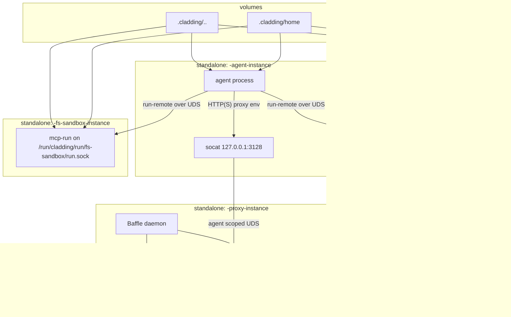

Cladding lets you run an agent in a constrained container environment where network access is intentionally narrow:

- The agent runs as a standalone `--network none` container named `<name>-agent-instance`.
- Optional delegated sandboxes run as standalone `--network none` containers named `<name>-nw-sandbox-instance` and `<name>-fs-sandbox-instance`.
- HTTP(S) egress is mediated by the standalone `<name>-proxy-instance` container. Execution containers keep their local `socat` listeners at `127.0.0.1:3128` and mount only their own Baffle data socket; no separate proxy bridge container is used.
- `<name>-nw-sandbox-instance` and `<name>-fs-sandbox-instance` each serve [`mcp-run`](crates/mcp-run/README.md) on a mounted Unix socket and execute commands only when allowed by their Rego policy modules under `.cladding/config/`.
- Proxy rules use native Baffle TOML under `.cladding/config/proxy/`.

The proxy startup script validates its mounted inputs, starts Baffle, and creates persistent sessions for the agent and (when enabled) the network sandbox. Cladding does not wait for those sessions before it starts the execution containers, so early proxy requests can fail while Baffle starts. Startup errors appear in the proxy container logs and exit status. `cladding reload-proxy` invokes `baffle reload --all` and requires a Baffle-enabled proxy runtime.

In short: the agent cannot freely access the network. From the host, `cladding exec --target nw-sandbox` or `cladding exec --target fs-sandbox` runs a command directly in an enabled sandbox. This host-initiated path bypasses the agent-side delegation and policy checks. Commands inside the agent can use `run-in-nw-sandbox` or `run-in-fs-sandbox` to delegate through those checks. `cladding run` creates an isolated, temporary runtime for one command and removes it when the command ends. `cladding exec` enters a runtime that is already running.

## Getting Started

* Install [Podman](https://podman.io/)
* Install the `cladding` binary:

  ```bash
  podman run --rm -it \
    -v $HOME/.local/bin:/target/bin \
    rust:latest \
    cargo install --git https://github.com/dstoc/cladding cladding --root /target --force
  ```

  Alternative (install Rust locally first):

  ```bash
  # install Rust
  curl --proto '=https' --tlsv1.2 -sSf https://sh.rustup.rs | sh
  # or on macOS with Homebrew
  brew install rust

  # from this repo
  cargo install --path . --bin cladding

  # or install directly from git
  cargo install --git https://github.com/dstoc/cladding cladding
  ```

* Initialize local config:

  Config and mounts are stored in a `.cladding` directory.

  ```bash
  cladding init
  # or override generated name
  cladding init myproject
  ```

* Edit files under `.cladding/config/`:

  - `.cladding/cladding.json` (generated by `cladding init`)
  - `.cladding/config/proxy/daemon.toml`
  - `.cladding/config/proxy/sessions/agent.toml`
  - `.cladding/config/proxy/sessions/nw-sandbox.toml`
  - `.cladding/config/nw_sandbox/` Rego policies when `nw_sandbox` is enabled (template dir: [`config-template/nw_sandbox/`](config-template/nw_sandbox/))
  - `.cladding/config/fs_sandbox/` Rego policies when `fs_sandbox` is enabled (template dir: [`config-template/fs_sandbox/`](config-template/fs_sandbox/))

  `cladding init` creates these TOML files when missing and preserves existing edits on later runs. These are the default session filenames. A disabled network sandbox does not require its selected session file.

  Baffle 1.0 requires session files in version 2 format. Existing projects
  keep their current session files because `cladding init` preserves edits.
  Migrate any version 1 session files before starting or reloading the proxy.
  See the [Baffle session migration steps](docs/features/baffle-integration/embedded-baffle.md#session-file-migration).

The proxy uses Baffle's `file_only` mode. `daemon.toml` defines the daemon and
its allowed symbolic secrets. The selected session files define the agent and
optional network-sandbox policies. By default, Cladding selects `agent.toml`
and `nw-sandbox.toml`. You can select separate files with
`proxy.agent.session_config` and `proxy.nw_sandbox.session_config` in
`cladding.json`. Each value is relative to
`.cladding/config/proxy/sessions/`; absolute paths and paths with `.` or `..`
components are rejected. `cladding check` validates the selected file for each
enabled component. It does not require the network-sandbox file when that
component is disabled. The proxy creates the network-sandbox session only
when that component is enabled. Fresh sessions have no host rules and set
`unmatched = "deny"`, so proxy destinations remain blocked until you add a
rule. To allow HTTPS to a host, add a hostname table such as
`[rules."api.example.com"]` to the relevant session file. See
[Proxy Configuration](docs/features/proxy/summary.md) for a complete example.
The agent and network sandbox can read these non-secret TOML files. They cannot
access the Baffle control socket, CA private key, or injection credentials.

* Build images and refresh host-mounted binaries (`mcp-run`, `run-remote`, `baffle`, and sandbox helper wrappers) in `.cladding/tools/bin`. See the [embedded Baffle build and update procedure](docs/features/baffle-integration/embedded-baffle.md): Baffle builds need Rust 1.96 or newer and native build tools; cross-build hosts can provide `CLADDING_BAFFLE_BIN`.

  ```bash
  cladding build
  ```

* Start the environment:

  ```bash
  cladding up
  ```

The normal setup order is `cladding init`, edit the files under
`.cladding/config/`, then run `cladding build`, `cladding check`, and
`cladding up`. `init` creates the Baffle configuration and private credential
storage. `build` creates local images, refreshes embedded tools, and initializes
the persistent project CA when it is not initialized. Later builds validate
and reuse the same CA. `check` and `up` validate the CA and never initialize or
rotate it. Run `cladding build` to initialize a missing CA before starting the
project.

* Execute commands in the agent container of an already-running project. Cladding maps the host working directory through the most-specific active host-backed mount for the selected target. If no active host-backed mount contains it, the command starts in `/home/user`:

  ```bash
  cladding exec codex --yolo
  cladding exec --env GEMINI_API_KEY gemini
  ```

* Run one command in a fresh environment and remove it when the command ends:

  ```bash
  cladding --config job.json run -- codex exec "Implement the task"
  cladding --cladding-dir /tmp/job/.cladding --config - run -- cargo test --workspace
  cladding run codex exec "Implement the task"
  cladding run --env FOO=bar -- env
  cladding run -v -- codex exec "Implement the task"
  GITHUB_TOKEN="$(mint-short-lived-token)" cladding run \
    --secret github-token=env:GITHUB_TOKEN -- codex exec "Implement the task"
  cladding run --secret github-token=file:/run/user/1000/token -- codex
  ```

  `run` creates a UUID-named instance and a private runtime directory outside the source workspace. It uses the selected project's `.cladding/config/`, `tools/`, `credentials/`, and `home/` directly, including selected Baffle session files and the persistent project CA. It creates only runtime files and sockets in the private runtime directory, then removes that directory when the command ends. Run requires a project initialized with `cladding init` and prepared with `cladding build`; it validates the project CA and does not create or rotate it. The command runs with the same agent working-directory and terminal behavior as `exec`. Use repeatable `--env KEY[=VALUE]` options before `--` to set environment variables for the command, as with `cladding exec`. Without `--config -`, it forwards stdin to the command. With `--config -`, stdin is reserved for the JSON configuration. The agent command cannot read stdin or use interactive input in that mode.

  Use repeatable `--secret NAME=env:VARIABLE` or `--secret NAME=file:PATH` options before `--` to provide Baffle secret values for one run. The symbolic name must match the name in the session rule and daemon allowlist. Cladding writes each value to a private `0600` file in the run directory and mounts that file read-only into the proxy. It does not change the project secret file or pass the value to the user command. The override file is removed with the runtime. Literal secret values are not accepted as `--secret` arguments. `--secret` applies only to `run`; persistent runtimes and `exec` continue to use project credentials.

  `cladding run` keeps successful startup and cleanup diagnostics quiet by default. Use `-v` or `--verbose` to show Podman and certificate setup output, instance details, and cleanup activity.

* Temporarily publish a TCP port from the agent container to the host while the project is running:

  ```bash
  cladding expose 3000
  cladding expose 3000 9000
  cladding expose 3000 --bind-address 192.168.1.20
  cladding expose 3000 9000 --bind-address ::1
  ```

  `cladding expose` runs in the foreground and defaults to listening on
  `127.0.0.1`. Use `--bind-address` to select a host IP address; `0.0.0.0`
  or `::` listens on all IPv4 or IPv6 interfaces respectively. Stop it with
  Ctrl-C.

* Temporarily make one host-reachable TCP endpoint available on agent localhost while the project is running:

  ```bash
  cladding inject 11434
  cladding inject 5432 15432
  cladding inject db.internal:5432 15432
  ```

  `cladding inject <host-endpoint> [containerport]` runs in the foreground and stops with Ctrl-C. A bare port such as `11434` maps agent `127.0.0.1:11434` to host `127.0.0.1:11434`. A second port changes only the agent-side listener, so `cladding inject 5432 15432` maps agent `127.0.0.1:15432` to host `127.0.0.1:5432`. An explicit `host:port` is resolved from the host and should be treated as a deliberate temporary exception for that one endpoint, not general host networking.

### Selecting the Cladding directory and configuration

Use `--cladding-dir PATH` to select the `.cladding` directory itself. Without this option, Cladding searches the invocation directory and its parents as before. This option selects Cladding runtime and configuration files. The agent workspace uses the invocation project: Cladding mounts the parent of a `.cladding` directory discovered from the invocation directory. If discovery finds none, Cladding uses the Git checkout root when available, or the invocation directory otherwise. The agent's working directory follows the invocation directory within that workspace.

Use `--config FILE` to load a specific JSON configuration file. Use `--config -` to read the JSON configuration from stdin. When omitted, Cladding loads `cladding.json` from the selected or discovered `.cladding` directory.

Both options are available to the configuration-consuming commands: `build`, `check`, `up`, `down`, `destroy`, `run`, `exec`, `logs`, `reload-proxy`, `expose`, and `inject`.

When both options are set, `--config` selects the configuration contents and `--cladding-dir` selects the runtime directory. Relative build paths and mount `hostPath` values resolve from the configuration file's directory. For stdin configuration, they resolve from the parent of the explicitly selected `.cladding` directory, or from the invocation directory when `--cladding-dir` is omitted.

Place shared options before the command when using commands that accept arbitrary command arguments:

```bash
cladding --cladding-dir /tmp/project/.cladding up
cladding --config ./custom.json exec codex --yolo
cladding --config ./custom.json run -- codex exec "Implement the task"
cladding --cladding-dir /tmp/project/.cladding down
cat custom.json | cladding --cladding-dir /tmp/project/.cladding --config - check
```

`init` accepts `--cladding-dir` to choose where it creates the directory. It does not read `--config`. `ps` lists all running projects, so it does not accept either project-specific option. Reading `--config -` consumes stdin as configuration; the same stdin stream is not available to a command run through `cladding run`.

### Project CA and injection credentials

`cladding init` prepares private Baffle credential storage under
`.cladding/credentials/baffle/` without creating a CA. On the first successful
`cladding build`, Cladding runs
`baffle ca init --config /opt/config/proxy/daemon.toml` in the selected proxy
image. Baffle reads the CA paths from that daemon configuration and creates:

```text
.cladding/credentials/baffle/
  ca.crt
  ca-key.pem
  secrets/
```

The generated CA uses an ECDSA P-256 key and expires 365 days after creation.
Baffle creates the private key with mode `0600` and the public certificate
with mode `0644`. Cladding validates and reuses the pair on later builds.
`cladding check` and `cladding up` validate the same CA state before startup;
they do not initialize or rotate the persistent CA.
If either file is missing, malformed, expired, or does not match its partner,
Cladding reports an error and leaves the material in place. It does not rotate
the CA automatically. The credentials directories use mode `0700`, and
secret files use mode `0600` on Unix hosts.

Users or external secret managers provision one file per Baffle symbolic secret in `secrets/`. Cladding creates this directory but does not create, copy, read, rewrite, or log secret values. Keep secret names in policy configuration and keep the values in these files. The proxy receives the credentials directory as a read-only mount. The agent and network sandbox receive a separate read-only mount of `ca.crt`; they do not receive the private key or secret files. The filesystem sandbox receives no CA mount.

To use an injection credential, add its symbolic name to
`[secrets].allowed` in `daemon.toml` and reference that name from a session
rule. Provision a regular file with that name under `secrets/`. Keep the
credentials directory at mode `0700` and each secret file at mode `0600` on
Unix hosts. Use a secret manager or another protected source to write the
file; do not put a secret value in TOML, a command argument, or a log. For a
single `cladding run`, use `--secret NAME=env:VARIABLE` or
`--secret NAME=file:PATH` to provide a run-specific value. Cladding reads the
host source into a private run file and does not add its value to the user
command's environment. Replace a persistent secret file through the same
protected process, then run `cladding reload-proxy`. The new value applies to
new connections; open connections keep the value they already use.

After Cladding creates the agent and enabled network-sandbox containers, it runs `podman exec --user 0` in each container. The command copies the public certificate to `/usr/local/share/ca-certificates/baffle.crt` and runs `update-ca-certificates`. UID 0 is container root for this exec; Cladding does not start the container as privileged. The workload still runs as its configured unprivileged user. The default `Containerfile.cladding` sets `NODE_USE_SYSTEM_CA=1` so Node.js uses the updated system trust store.

Custom agent and network-sandbox images must support the same initialization command. They need `sh`, `cp`, a writable `/usr/local/share/ca-certificates/` directory, and an `update-ca-certificates` command that adds certificates from that directory to the system trust store. Images with another trust-store layout can provide a compatible command in the image. Cladding does not provide a per-image initialization hook. Applications that use a private CA bundle or another application-specific trust store may need a separate import step. Certificate-pinned applications can reject intercepted connections even when the system trusts the CA.

`cladding down` and `cladding destroy` remove runtime resources but keep the
project CA and secrets. `cladding run` uses the selected project's CA and
credentials read-only. It does not create a separate CA or copy credentials into
the temporary runtime. Its sockets and other generated runtime files stay in
the UUID-scoped runtime directory and are removed during cleanup.

To rotate a CA, stop the project, move the full `credentials/baffle` directory to a protected backup outside version control, then run `cladding build` to generate a new CA. Provision the required secret files again through the secret manager. Distribute the new `ca.crt` to clients, update their trust stores, and remove trust in the old CA after clients have moved. The backup contains both the private key and any provisioned secrets; protect it accordingly.

New `.cladding` directories contain an internal ignore file. For an existing project layout, confirm that the repository ignores `.cladding/credentials/` before provisioning credentials. Never commit `ca-key.pem` or secret files.

### Reloading proxy policy

After editing a selected session file, run `cladding reload-proxy`. Baffle reads the active sessions' selected files and reports each session as `reloaded`, `unchanged`, or `failed`. It reports all session results, even when one reload fails, and the command exits unsuccessfully if any session fails. Invalid updates leave the prior effective session in place. Changing a `session_config` selection requires recreating the proxy runtime with `cladding down` and `cladding up`.

Changed policy, injection credentials, and socket paths apply to new connections. Existing connections keep their prior policy and credentials until they close, so a credential change does not revoke access on an already-open connection. A reload can fail when an old policy generation or listener is still in use; inspect `cladding logs proxy` to diagnose it. Changes to daemon settings, the CA, or the Baffle binary require a proxy container restart.

### Proxy behavior and migration limits

The execution containers keep the local HTTP proxy endpoint
`http://127.0.0.1:3128`. The `http://` scheme describes the connection from
the application to its local proxy. Baffle accepts HTTPS origins through
HTTP `CONNECT`; it does not permit ordinary plaintext HTTP origins. A rule
must name an exact DNS hostname and explicit port. Wildcard hostnames and
literal IP addresses are not supported.

Baffle checks the requested hostname and port. It does not pin DNS results or
filter destination IP addresses. A hostname rule therefore does not prevent a
hostname from resolving to an internal or private address. Add separate DNS
or network controls when Baffle's outbound destinations need IP restrictions.

Cladding does not read or convert old Squid configuration, domain lists, or
host-port lists. Replace those files with native TOML under
`.cladding/config/proxy/`. See [Proxy Configuration](docs/features/proxy/summary.md)
for the file roles, security boundaries, and policy examples. The separate
`cladding expose` and `cladding inject` commands remain available as deliberate
host-network exceptions. The filesystem sandbox still has no proxy egress by
default.

### Configuring container images

Each component can use an existing image or build one from a Containerfile. The component `image` value is the build output tag when `build` is also set. If `image` is omitted, `cladding build` generates a local tag such as `localhost/cladding-myproject-agent:latest`.

```json
{
  "name": "myproject",
  "agent": {
    "build": {
      "containerfile": "containers/agent.Containerfile",
      "context": ".",
      "args": { "FEATURE": "enabled" }
    }
  },
  "nw_sandbox": {
    "enabled": true,
    "image": "localhost/my-sandbox:latest",
    "build": {
      "containerfile": "containers/sandbox.Containerfile",
      "context": ".."
    }
  },
  "fs_sandbox": {
    "image": "localhost/my-fs-sandbox:latest",
    "build": {
      "containerfile": "containers/fs-sandbox.Containerfile",
      "context": ".."
    }
  },
  "proxy": {
    "image": "localhost/my-proxy:latest",
    "build": {
      "containerfile": "containers/proxy.Containerfile",
      "context": "."
    }
  }
}
```

`containerfile` and `context` paths are relative to `.cladding/cladding.json`. `context` defaults to the `.cladding` directory when omitted. Build `args` are string values passed to Podman as ordinary Containerfile build arguments.

`cladding build` preserves the embedded default image build and its host `UID` and `GID` arguments. It builds each shared image once and reports an error if components specify different builds for the same image tag.

### Selecting Baffle session files

The default session files are `.cladding/config/proxy/sessions/agent.toml` and
`.cladding/config/proxy/sessions/nw-sandbox.toml`. Set a component's
`session_config` under `proxy` to select another file:

```json
{
  "proxy": {
    "agent": {
      "session_config": "agent-restricted.toml"
    },
    "nw_sandbox": {
      "session_config": "restricted/network.toml"
    }
  }
}
```

Cladding resolves each value only under
`.cladding/config/proxy/sessions/`. Use a relative filename or nested path.
Cladding rejects absolute paths, `.` components, `..` components, and symlinks.
The two selections are independent. `cladding check` requires and validates
the agent file and, when `nw_sandbox` is enabled, the selected network-sandbox
file. A disabled network sandbox does not require its selected file. See the
[working example](examples/proxy-session-selection/).

The default proxy image is built from Debian trixie slim. It includes GNU libc, a POSIX shell, the startup utilities, and system CA certificates. It does not include Cargo or a Rust toolchain. A custom `proxy.image` or `proxy.build` image must provide `/bin/sh`, `mkdir`, `chmod`, `dirname`, `sleep`, and compatible GNU libc runtime support for the embedded Baffle executable.

### Configuring mounts

`cladding.json` supports a `mounts` list. Each entry has:

* `mount` (required, absolute path in the container)
* `hostPath` (optional, host bind mount; relative paths are resolved from `.cladding/`)
* `volume` (optional, named volume; mutually exclusive with `hostPath`)
* `type` (optional: `bind`, `readonly`, `copy`, or `tmpfs`; omitted `type` defaults host paths to writable binds and keeps existing volume and empty mount behavior)
* `size` (optional size string for `type: "tmpfs"`, such as `1GiB`; the default limit is `64MiB`)
* `readOnly` (deprecated; accepted for compatibility on existing mounts, but new read-only host mounts should use `type: "readonly"`)
* `targets` (optional; explicit list of `agent`, `nw-sandbox`, `fs-sandbox`)
* `ignore` (optional, default `false`; when true, removes an existing default mount at the same `mount` path instead of replacing it)

If `type` is omitted and neither `hostPath` nor `volume` is set, a managed empty runtime volume is mounted read-only. This is intended for masking or hiding underlying files.
Mounts apply to the components named in `targets`. When `targets` is omitted, the mount applies to the agent and to `nw-sandbox` when it is enabled. `fs-sandbox` only receives custom mounts that explicitly target `fs-sandbox`.

`bind`, `readonly`, and `copy` require `hostPath`. `bind` shares a live host directory. Writes affect the host source unless the mount is read-only. `readonly` prevents container writes to the host source.

`copy` snapshots the host directory once into a Cladding-managed disposable volume. The snapshot includes dotfiles and preserves symlinks and permission bits; Cladding maps copied ownership to UID/GID `1000` so the standard Cladding user can access private files under rootless Podman. Containers can change the snapshot without changing the host source. When one `copy` declaration targets multiple containers, they mount the same volume and see each other's writes. Later changes to the host source do not appear in the running runtime. Cladding removes the volume on `down` or after `run` completes. Seeding the snapshot takes time and uses disk space proportional to the source tree.

Cladding no longer supports `overlay`. Podman's normal `:O` mount gives each container a separate writable upper layer, so it cannot provide one shared filesystem to multiple targets. Cladding reports an error for existing `overlay` declarations and directs users to `copy`, which provides a host snapshot with shared writable state.

`tmpfs` is a disposable, memory-backed mount and cannot use `hostPath` or `volume`. Cladding accepts byte values and `K`, `M`, `G`, `T`, `KiB`, `MiB`, `GiB`, and `TiB` size units; decimal `KB`, `MB`, `GB`, and `TB` units are also accepted. Podman receives the limit in bytes. Cladding sets mode `1777` and asks Podman to set ownership to the container's mapped user and group. One target uses a container tmpfs. Multiple targets share one Cladding-managed tmpfs-backed volume. Contents disappear when the runtime stops. The default limit is `64MiB` when `size` is omitted.

`volume` keeps normal named-volume persistence semantics. Cladding does not remove these user-managed volumes on `down` or after `run`.

Cladding keeps the `.cladding` mask beneath workspace copy and read-only mounts whose host source contains the private `.cladding` directory. A `readonly` or `copy` mount cannot use a path inside `.cladding` as its host source.

Example:

```json
{
  "agent": {
    "image": "cladding-agent:local"
  },
  "nw_sandbox": {
    "enabled": true,
    "image": "cladding-sandbox:local"
  },
  "mounts": [
    { "mount": "/home/user/workspace/.cache/npm", "volume": "npm-cache" },
    { "mount": "/opt/data", "hostPath": "../data", "type": "readonly" },
    { "mount": "/home/user/workspace", "hostPath": "..", "type": "copy", "targets": ["agent", "nw-sandbox"] },
    { "mount": "/tmp/cache", "type": "tmpfs", "size": "1GiB", "targets": ["agent", "nw-sandbox"] },
    { "mount": "/tmp/isolated" },
    { "mount": "/opt/nw-sandbox-only", "hostPath": "../nw-sandbox-data", "targets": ["nw-sandbox"] },
    { "mount": "/opt/fs-sandbox-only", "hostPath": "../fs-sandbox-data", "targets": ["fs-sandbox"] }
  ]
}
```

Default mounts for the agent and `nw-sandbox` (as if expressed via `mounts`):

```json
{
  "mounts": [
    { "mount": "/opt/config", "hostPath": "config", "type": "readonly" },
    { "mount": "/opt/tools", "hostPath": "tools", "type": "readonly" },
    { "mount": "/home/user", "hostPath": "home" },
    { "mount": "/home/user/workspace", "hostPath": ".." },
    { "mount": "/home/user/workspace/.cladding" }
  ]
}
```

The `fs-sandbox` default mount set is narrower: `/opt/config` and `/opt/tools` are mounted read-only, plus an internal run socket under `/run/cladding/run/fs-sandbox`. It does not receive `/home/user`, `/home/user/workspace`, or the `.cladding` workspace mask unless custom mounts explicitly target `fs-sandbox`.

Default mounts may be overridden by adding an entry with the same `mount` value, or removed by adding an entry with the same `mount` and `"ignore": true`. The `.cladding` workspace mask cannot be removed with `ignore` for the agent or `nw-sandbox`.

## Architecture + Network Controls

Current runtime shape:

- `<name>-proxy-instance` is a standalone container. It runs Baffle and creates persistent proxy sessions.
- The proxy uses Podman's default network. Execution containers use `--network none`.
- `<name>-agent-instance`, `<name>-nw-sandbox-instance`, and `<name>-fs-sandbox-instance` are standalone execution containers with `--network none`.
- Execution containers communicate through scoped Unix-domain socket mounts under `.cladding/runtime/sockets`.
- `use_runsc`, when enabled, applies only to the standalone execution containers.


```mermaid
flowchart TB
  subgraph C["standalone: <name>-agent-instance"]
    CA[agent process]
    CAP[socat 127.0.0.1:3128]
  end

  subgraph H[volumes]
    WS[.cladding/..]
    HOME[.cladding/home]
  end


  subgraph S["standalone: <name>-nw-sandbox-instance"]
    SAP[socat 127.0.0.1:3128]
    SA[mcp-run on /run/cladding/run/nw-sandbox/run.sock]
  end

  subgraph F["standalone: <name>-fs-sandbox-instance"]
    FA[mcp-run on /run/cladding/run/fs-sandbox/run.sock]
  end

  subgraph P["standalone: <name>-proxy-instance"]
    PX[Baffle daemon]
    AGS[Persistent agent session]
    NWS[Optional persistent nw-sandbox session]
    PX --> AGS
    PX --> NWS
  end

  WS --> CA
  WS --> SA
  WS --> FA
  HOME --> CA
  HOME --> SA
  HOME --> FA

  CA -- run-remote over UDS --> SA
  CA -- run-remote over UDS --> FA
  CA -- HTTP(S) proxy env --> CAP
  CAP -- agent scoped UDS --> AGS
  SAP -- nw-sandbox scoped UDS --> NWS
  SA -- HTTP(S) proxy env --> SAP
```

The filesystem sandbox has no proxy socket mount and no proxy environment by default. It can run allowed commands through `mcp-run`, but it is not given HTTP(S) egress.

## Useful Commands

```bash
cladding init [name]  # create .cladding config and runtime layout
cladding build       # build images, refresh embedded tools, initialize persistent Baffle CA
cladding check        # verify project prerequisites, including the persistent Baffle CA
cladding ps           # list running cladding projects
cladding run [-v|--verbose] [--env KEY[=VALUE] ...] [--secret NAME=env:VARIABLE|file:PATH ...] [--] <cmd> [args...] # create a temporary runtime, run a command, and remove the runtime
cladding exec [--target agent|nw-sandbox|fs-sandbox] [--env KEY[=VALUE] ...] <cmd> [args...] # execute in the selected container of a running runtime
cladding expose <containerport> [hostport] [--bind-address <address>] # block while forwarding host address/port to agent containerport
cladding inject <host-endpoint> [containerport] # block while forwarding agent localhost containerport to a host-reachable endpoint
cladding reload-proxy
cladding logs [agent|proxy|nw-sandbox|fs-sandbox] [podman logs args...] # view container logs
cladding down         # stop managed containers
cladding destroy      # force-remove running containers
cladding up           # validate prerequisites and start the containers
cladding logs proxy -f       # follow proxy logs
cladding logs nw-sandbox -f  # follow network sandbox (mcp-run) logs
cladding logs fs-sandbox -f  # follow filesystem sandbox (mcp-run) logs
```

`cladding exec` defaults to `agent`. Its `nw-sandbox` and `fs-sandbox` targets run directly from the host; they do not use the agent's delegation or policy path. Inside the agent container, use `run-in-nw-sandbox -- <cmd> [args...]` or `run-in-fs-sandbox -- <cmd> [args...]` to request an allowlisted command through `run-remote` over the component-specific Unix socket. The filesystem sandbox has no workspace mount by default, so a command targeting it starts in `/home/user` unless its configuration adds a workspace mount.
