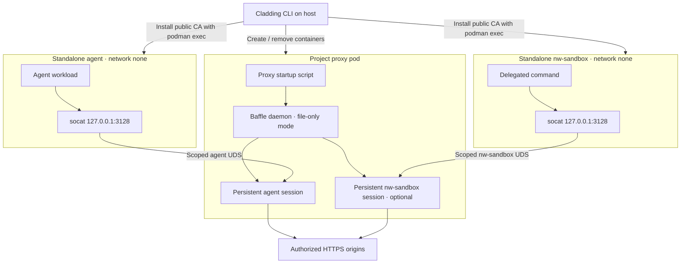

# PRD: Replace Squid with Baffle in Cladding

**Status:** Historical design proposal; the Baffle runtime is implemented. See `docs/features/current-runtime-summary.md` and `README.md` for current behavior.
**Repository:** `dstoc/cladding`  
**Intended path:** `docs/features/baffle-integration/prd.md`  
**Issue IDs:** `baffle-1` through `baffle-12`

## Summary

Replace Cladding's Squid-based proxy with [Baffle](https://github.com/dstoc/baffle), a Linux daemon that manages independent, policy-controlled HTTPS proxy sessions. Cladding will run one Baffle daemon per project in its existing proxy pod. The proxy container will create and supervise persistent, file-backed sessions for the agent and (when enabled) the network sandbox. The execution containers retain their existing localhost `socat` listeners and independently mounted Unix data sockets.

Use Baffle's native TOML files under `.cladding/config/proxy/` rather than translate or preserve Squid domain lists. Build a pinned `baffle-proxy` version from crates.io, embed its Linux `baffle` executable in Cladding alongside `mcp-run`, and extract it into `.cladding/tools/bin/` during `cladding build`.

Each project has one persistent interception CA. Cladding provisions its public certificate into the agent and network-sandbox system trust stores with `podman exec --user 0` after starting those containers. Injection credentials live outside the configuration directory and are visible only to Baffle. The ordinary configuration directory remains readable in the agent and network sandbox; hiding it is **not** part of this project.

## Goals

- Replace Squid and its bridge sidecar with one Baffle daemon and separately configured proxy sessions.
- Make Baffle TOML the only user-facing proxy configuration; no Squid compatibility layer.
- Preserve the existing container model, scoped Unix data-socket paths, client-side `socat` listeners and application proxy URLs.
- Keep proxy startup and initial session creation inside the proxy container; Cladding owns container and project lifecycles.
- Support project-scoped TLS interception and daemon-owned header injection without exposing CA private keys or secret values to execution containers.
- Support normal `cladding up`/`down`/`destroy`, `cladding run`, and explicit `cladding reload-proxy`.
- Produce reproducible packaged Cladding binaries with Baffle embedded and covered by CI and integration tests.

## Non-goals for phase one

- No Cladding-level Baffle-session readiness barrier. Initial connection attempts may fail while the proxy container is starting; revisit this separately if needed.
- No Baffle control-socket access from the agent or network sandbox and no per-command session creation. These are deferred to `baffle-12`.
- No compatibility for existing Squid configuration, domain lists, host-port lists, or plaintext HTTP access.
- No Baffle-specific policy language, domain-list-to-TOML translation, or wildcard-host emulation in Cladding.
- No host-level Baffle daemon or host service-manager integration.
- No changes to filesystem-sandbox networking: it remains without proxy egress by default.
- No requirement to conceal non-secret Baffle TOML configuration from the agent or network sandbox.

## Pre-Baffle architecture

Cladding currently runs a Squid instance and a `socat` bridge sidecar in the project proxy pod. Squid distinguishes agent and network-sandbox traffic by separate local listeners. The standalone execution containers use `--network none` and scoped Unix sockets, and each runs a local `socat` listener on `127.0.0.1:3128`. Cladding mounts `.cladding/config/` read-only into its execution containers.

## Target architecture



Baffle binds its Unix data sockets directly into Cladding's existing proxy socket directories. Only the applicable per-component data-socket directory is mounted into each execution container. The daemon's private control socket is accessible to the proxy startup script and in-container `baffle` commands, not to execution containers in phase one.

The existing client-side `socat` commands and `http_proxy`/`https_proxy` values (`http://127.0.0.1:3128`) remain unchanged. The `http://` prefix identifies the local HTTP proxy endpoint; it does not enable plaintext HTTP origins through Baffle.

The intended result removes the proxy bridge sidecar. Validate that Baffle's mode-`0600` data sockets and mode-`0700` parent directories work with rootless Podman UID mappings, macOS Podman-machine mounts, and optional `runsc` before treating that removal as complete. If direct access cannot satisfy those constraints, retain a *minimal trusted bridge in the proxy container* rather than broadening socket permissions or exposing the control socket. Do not add a second proxy engine.

When the trusted relay is required, keep its Baffle-owned sockets in a fresh mode-`0700` directory under `/tmp`, outside the mode-`1733` control-socket parent. Baffle 0.2.0 opens every data-socket path parent with `O_RDONLY | O_DIRECTORY`; it cannot traverse a mode-`1733` parent as a non-owner even when search access is allowed. Keep the control socket under `/run/baffle` and expose only the relay sockets through the scoped runtime mounts.

## User-editable configuration

Use these native files, materialized by `cladding init` and editable thereafter:

```text
.cladding/
  cladding.json
  config/
    agent/                       # Existing non-proxy agent configuration, if any
    nw_sandbox/                  # Existing Rego and command policy
    fs_sandbox/                  # Existing Rego and command policy
    proxy/
      daemon.toml
      sessions/
        agent.toml
        nw-sandbox.toml
  credentials/
    baffle/
      ca.crt
      ca-key.pem
      secrets/
        <secret-name>
  tools/bin/
    baffle
  runtime/
    scripts/proxy_startup.sh
    sockets/proxy/
      agent/proxy.sock
      nw-sandbox/proxy.sock
```

The network-sandbox session file may exist even when that component is disabled; the startup script must not create its session unless enabled. Do not remove unrelated agent, network-sandbox or filesystem-sandbox Rego configuration.

Cladding continues to mount `config/` read-only into the agent and network sandbox. Their ability to read `config/proxy/*.toml` and `config/proxy/sessions/*.toml` is intentional. TOML must contain policy, paths and **symbolic secret names only**, never credential values, private keys or control-socket capabilities.

The default daemon TOML should use Baffle's exact schema with `create_mode = "file_only"`, a session configuration directory under the read-only config mount, an in-container private control socket, a session socket directory backed by Cladding's scoped runtime sockets, the project CA paths, and `[secrets].directory` pointing to the private credentials mount. An illustrative layout (adjust the UID to the actual proxy-container user) is:

```toml
[daemon]
control_socket = "/run/baffle/control.sock"
socket_dir = "/run/cladding/proxy"
trusted_operator_uid = 0
create_mode = "file_only"
session_config_dir = "/opt/config/proxy/sessions"

[ca]
certificate = "/opt/credentials/baffle/ca.crt"
private_key = "/opt/credentials/baffle/ca-key.pem"

[secrets]
directory = "/opt/credentials/baffle/secrets"
allowed = []
```

For a session using an exact hostname, the native file has this form:

```toml
version = 1
operation = "create"

[session]
persistent = true
socket_name = "agent/proxy.sock"

[[rules]]
host = "example.com"
mode = "tunnel"
ports = [443]
```

The network-sandbox template uses `socket_name = "nw-sandbox/proxy.sock"`. Configure `mode = "intercept"`, `paths`, and `[[rules.inject]]` directly in native session TOML where required. Baffle requires at least one host rule per active session. Default template rules should be explicit, conservative and documented, not wildcard placeholders.

Baffle validates file and directory ownership, permissions and symlink safety in file-only mode. Cladding's template/materialization paths and the proxy-container UID must satisfy those checks under the supported Podman environments. Native TOML may use fixed in-container paths; users do not have to manage host mount paths inside individual session files.

There is no backward compatibility requirement. Remove Squid's config template, domain-list and host-port-list wiring, startup logic, documentation and obsolete checks. Other Cladding features such as `cladding inject` remain separate and unchanged. In particular, Baffle supports exact hostnames and explicit HTTPS ports, not unrestricted plaintext access to `host.containers.internal`.

## Binary packaging and proxy image

Pin a published `baffle-proxy` crate version and install its `baffle` executable using Cargo with `--locked` during Cladding's build. Extend the current `build.rs`/embedded-tools approach used for `mcp-run` and `run-remote`, and extract the binary through `cladding build` to `.cladding/tools/bin/baffle`. Include it in the required-tool/version checks. Do not download GitHub release assets.

Provide a `CLADDING_BAFFLE_BIN` override for CI or cross-platform Cladding releases that embed a separately built Linux binary, including macOS host builds. Baffle's Rust toolchain and CMake/libclang dependencies belong to its build environment, not the runtime image. Build the Linux executable in a controlled environment with a GNU libc compatible with the selected proxy runtime image; check target architecture and dynamic dependencies. The initial target matrix should match Cladding's supported Linux execution environments, with unsupported targets diagnosed explicitly.

Replace the Squid proxy image with a small compatible Linux image. It needs the embedded Baffle executable mounted read-only, a shell for `proxy_startup.sh`, runtime TLS libraries and any minimal utilities used by startup; it does **not** need Cargo or the full Rust toolchain. Preserve Cladding's ability to override the proxy image/build where compatible.

## Project CA and injection credentials

Each persistent Cladding project owns a single Baffle interception CA under `.cladding/credentials/baffle/`. Cladding creates it **before container startup**, so the certificate exists when the execution containers' read-only file mounts are established. Generate a Baffle-compatible CA certificate/private-key pair (CA basic constraints, certificate-signing key usage, valid dates and matching key). Prefer a portable in-process Rust implementation or another generation method that works on all supported Cladding hosts without requiring the host to install a separate service.

Create missing files atomically and restrict permissions: `credentials/baffle/` and `secrets/` mode `0700`, `ca-key.pem` and each secret mode `0600`, public `ca.crt` mode `0644`. Reuse an existing valid CA; if it is incomplete, expired or invalid, report a precise failure rather than replacing it silently. Define an explicit, documented CA-rotation procedure because old intercepted connections and trust stores can outlive a rotation. Cladding's `.cladding/.gitignore` already ignores its contents for newly initialized projects; do not assume older/external source-control layouts have equivalent protection, and document keeping credentials out of version control.

Users or external secret managers provision one file per Baffle symbolic secret under `credentials/baffle/secrets/`. Cladding creates the directory but does not generate, overwrite, inject through environment variables or log credential values. The daemon's `[secrets].allowed` list controls which names Baffle may use; session rules reference only those names. Baffle checks credentials during session creation and reload.

The proxy container receives the full credentials directory read-only, with ownership mapped so its trusted UID can read the private files. The agent and network sandbox receive **only the public `ca.crt`**, as a separate read-only mount at `/run/cladding/ca/baffle.crt`. They must not receive the CA private key or injection secret files. Their existing read-only configuration mounts are unaffected.

`cladding run` must retain its current private runtime and cleanup behavior. A one-off instance should have a private CA and runtime socket namespace; when an existing `.cladding` project has been explicitly selected, it may use its separately selected, read-only secret source without copying the secret values. When no project exists, create an ephemeral credentials directory with no injection secrets and remove it with the one-off runtime. The implementation should document any deliberate sharing of an existing project's persistent CA instead of accidentally depending on host paths.

## Proxy-container startup and supervision

The proxy container owns the Baffle-specific initialization sequence:

1. Verify the mounted configuration, public CA, private key and secret directory are present and readable; do not create or rewrite user-provisioned secret files.
2. Start `baffle daemon --config /opt/config/proxy/daemon.toml` in file-only mode; use a private in-container control-socket directory.
3. Wait locally for the daemon control socket to accept commands. This is an internal startup dependency, **not** a Cladding-level readiness barrier.
4. Run `baffle create agent.toml` to establish the persistent agent session. If the network sandbox is enabled, also run `baffle create nw-sandbox.toml`.
5. Supervise the daemon process. Forward shutdown signals and stop it on partial initialization failure. If it terminates unexpectedly, exit the proxy container unsuccessfully.

The script must not run a long-lived ephemeral `baffle create` as its session manager. Its default session files set `persistent = true`, so creation returns immediately and the daemon owns each session until stopped or shut down. Fixed socket names allow reuse of Cladding's scoped proxy socket mounts.

`cladding up` retains normal Podman orchestration, without waiting for the proxy's sessions to be ready before starting execution containers. A proxy startup failure can therefore be asynchronous and must be evident through `cladding logs proxy` and the container's exit status. Do not claim synchronous session-readiness guarantees or add a polling barrier in phase one.

## Public CA trust in execution containers

Add `ENV NODE_USE_SYSTEM_CA=1` to Cladding's default Node.js 24-based `Containerfile.cladding`. After creating the agent and enabled network-sandbox containers, Cladding runs a **one-time privileged exec inside each container** as UID 0. For the default Debian-based image:

```sh
podman exec --user 0 "$container" sh -ec '
  cp /run/cladding/ca/baffle.crt \
    /usr/local/share/ca-certificates/baffle.crt
  update-ca-certificates
'
```

`--user 0` runs as container root; it does not mean Podman `--privileged` or host root. The normal application process retains its configured unprivileged user. Repeat installation for every new execution-container instance, including `cladding run`. If installation fails, report an error and use Cladding's existing ownership-aware cleanup path for resources created by that invocation.

The existing filesystem sandbox has no proxy egress by default and does not need this CA step. Document custom-image requirements (`update-ca-certificates` or an equivalent), trust-store differences for tools that do not use system roots, and certificate-pinning limitations. Verify `podman exec --user 0` works for both normal and optional `runsc` execution containers. Installing the certificate adds Baffle to the container's general system trust store; that broader trust is an intentional per-project decision.

The certificate must exist before mounting it, but Cladding does **not** wait for Baffle to finish creating its sessions. An early application request can fail until the proxy is ready; a future readiness issue may address that separately.

## Data sockets, UID mapping and isolation

Reuse `.cladding/runtime/sockets/proxy/agent` and `.cladding/runtime/sockets/proxy/nw-sandbox` as host-backed directories. Mount the parent into the proxy container as Baffle's data-socket directory, and mount only the corresponding subdirectory into each execution container at its existing path. Set safe owner/mode on the Baffle socket root and child directories; do not relax Baffle's `0600` socket or `0700` directory model to make mounts work.

The proxy and execution containers use ordinary rootless `keep-id` mappings so they access mode-`0600` data sockets as their owning user. Do not assume that a custom UID or GID remap works on every Podman host. On Linux, Baffle binds its scoped data sockets directly in the host-backed directories. On macOS with Podman machine, Baffle binds the session sockets inside the proxy container, and a trusted `socat` relay exposes one mode-`0600` socket per enabled session through a component-specific Podman-managed volume. That volume overlays the matching directory under `/run/cladding/proxy` in the proxy container and is mounted only into the matching execution container. This avoids relying on Podman machine's shared host mount for the socket and parent-directory modes. The relay runs in the proxy container and has no access to Baffle's control socket. Custom proxy images must include `socat` for this path. Baffle's control socket and runtime configuration stay in a private directory inside the proxy container. The sticky-mode `1733` parent lets the mapped proxy user create a mode-`0700` child directory that Baffle accepts as owned by its trusted operator; runtime config and control socket files use mode `0600`. A symlink preserves Baffle's default control-socket path. Execution containers do not mount or access the control directory. At startup, Cladding sets Baffle's trusted operator UID to the proxy process UID in its user namespace.

Execution containers retain `--network none` and access only their assigned data socket. The proxy container retains normal outbound network access. Filesystem sandbox networking stays unchanged. The agent and network sandbox can continue reading `config/proxy/daemon.toml` and the session TOML files; **only the control socket, CA private key, and credential files are restricted**.

Baffle's file-only mode restricts *what policy source* a control client can request, not which file or operation that UID can select. In phase one, do not mount the control socket into execution containers. Future per-command delegation must have its own authorization design; hiding TOML configuration is not a security requirement or substitute for control authorization.

## Reload, commands and cleanup

Keep the existing `cladding reload-proxy` CLI name, but replace the Squid reconfigure action with `podman exec` into the proxy instance, invoking `baffle reload --all` on its private control socket. Cladding does not rewrite the native TOML before reload. Report each session's `reloaded`, `unchanged` or `failed` status and return a failing exit status if any reload fails. Baffle reloads file-backed sessions only; changing daemon-level settings, replacing the CA or upgrading the executable requires the relevant container restart.

Baffle applies changed policy and resolved credential values to **newly accepted connections**. Existing connections keep their prior policy and credentials until they close; reload is not immediate credential revocation. The Baffle implementation can reject a non-disruptive reload if old generations/listeners remain pinned. Document these limitations and support diagnosis via proxy logs.

`cladding down`/`destroy` remove the project proxy pod, session sockets and other disposable runtime resources. They must **not** delete the persistent project CA or injection secrets. One-off instances are removed by the current `run` cleanup workflow. Retain existing running-project discovery and collision semantics, adapted to the new expected container set (the old Squid bridge no longer counts).

## Security and compatibility notes

- Baffle accepts HTTPS origins via CONNECT and rejects ordinary plaintext HTTP. An allowed TLS service on port 80 still requires an explicit port-80 rule and HTTPS over CONNECT.
- Baffle requires exact DNS hostnames, not wildcard destinations or literal IPs. A hostname allowlist is not destination-IP containment: Baffle does not pin DNS results or block internal/private resolved addresses. Cladding's existing `--network none` protects execution containers against direct egress, but deployments needing to constrain *Baffle's* destination IPs must supply separate DNS/network controls.
- Tunnel-only rules do not allow path restrictions or credential injection. They do not prove tunneled payloads are TLS and leave certificate validation to the client. Intercept rules can restrict paths and inject headers, but interception clients must trust the project CA and certificate-pinned clients may not work.
- The Baffle control socket authenticates by UID. Do not confuse readable policy TOML with authorization to create, reload, list or stop sessions; keep the control socket private to the proxy container until a restricted delegation mechanism is designed.
- Injection credentials, private CA key and private control socket must never be mounted into the agent or network sandbox. Read-only access to non-secret native configuration is explicitly permitted.
- `cladding expose` and `cladding inject` are separate, deliberate host-network exceptions and are not reimplemented using Baffle in this phase.

## Validation

Unit and integration coverage should establish:

- `init` creates valid native templates and no required Squid artifacts; Baffle file-only permission/ownership validation succeeds with normal project mounts.
- The agent and enabled network sandbox receive distinct, correctly scoped data sockets; a disabled network sandbox produces no active Baffle session; the filesystem sandbox receives none.
- Both execution containers can use intercepted HTTPS with a CA installed by `podman exec`; check the default `NODE_USE_SYSTEM_CA=1` behavior and representative curl/Git/Node applications.
- Exact-host allow/deny, plaintext HTTP rejection, path-restricted interception, header injection and absence of secret material from execution-container mounts and logs.
- Persistent project CA reuse, invalid/expired CA handling, secrets permissions, and `cladding run` isolation and cleanup.
- Rootless Podman ownership and direct socket access; test `runsc` and macOS Podman-machine integration where Cladding claims support. Use a minimal trusted proxy-side bridge only if direct mapping cannot pass.
- Reload reports changed, unchanged and failed sessions correctly, leaves established connections running, and picks up permitted credential changes on new connections.
- Normal `up`, `down`, `destroy`, `run`, failure cleanup and container inventory without the former Squid sidecar. A test may wait for the proxy to become ready; production Cladding must not add a readiness barrier.
- CI and release artifacts contain an executable, compatible pinned Baffle binary and applicable third-party license/notice material.

Document the user-visible incompatible migration and update the README, architecture/current-runtime summary, command help and configuration examples. Remove or clearly mark superseded Squid documentation rather than describing it as current.

## Implementation issues

Every implementation issue should link to this proposal with:

> Context: `docs/features/baffle-integration/prd.md` (phase-one requirements and decisions; `baffle-12` is deferred).

| ID | Scope | Depends on |
| --- | --- | --- |
| `baffle-1` | Replace Squid configuration/templates with native Baffle TOML | none |
| `baffle-2` | Manage project CA and injection-credential directory | none |
| `baffle-3` | Build and embed pinned Baffle from crates.io | none (external prerequisite: crate published) |
| `baffle-4` | Build proxy image and container-managed Baffle startup | `baffle-1`, `baffle-2`, `baffle-3` |
| `baffle-5` | Bind scoped Baffle data sockets and remove Squid bridge | `baffle-4` |
| `baffle-6` | Install public CA in execution containers | `baffle-2` |
| `baffle-7` | Integrate Baffle with Cladding runtime and `run` lifecycle | `baffle-4`, `baffle-5`, `baffle-6` |
| `baffle-8` | Implement Baffle-backed `cladding reload-proxy` | `baffle-7` |
| `baffle-9` | Integration and security tests | `baffle-7`, `baffle-8` |
| `baffle-10` | CI, packaging and release updates | `baffle-3`, `baffle-9` |
| `baffle-11` | README, architecture and migration documentation | `baffle-7`, `baffle-8`, `baffle-9` |
| `baffle-12` | **Deferred:** authorized per-command network-sandbox sessions | `baffle-9` |

The `baffle-5` issue must **not** require hiding Baffle configuration from the agent or network sandbox. The `baffle-12` issue must focus on authorization and limited control capabilities, not configuration secrecy. Preserve the exact `depends-on: ...` lines in each issue description as specified by the issue graph.

## Source references

- Cladding [current runtime summary](https://github.com/dstoc/cladding/blob/main/docs/features/current-runtime-summary.md), [runtime components](https://github.com/dstoc/cladding/blob/main/src/runtime/components.rs) and [embedded tools](https://github.com/dstoc/cladding/blob/main/src/assets.rs).
- Baffle [configuration](https://github.com/dstoc/baffle/blob/main/docs/configuration.md), [security/deployment](https://github.com/dstoc/baffle/blob/main/docs/security-deployment.md), [Cladding integration](https://github.com/dstoc/baffle/blob/main/docs/cladding-integration.md), [client lifecycle](https://github.com/dstoc/baffle/blob/main/docs/client.md), and [crates.io release process](https://github.com/dstoc/baffle/blob/main/docs/releasing.md).
